# Shark Attack Dataset — EDA Report

**Dataset:** `preprocessed.csv` — 6,999 records, 34 columns
**Period covered:** 1543–2026 (analysis focuses on 1900–2025 for time-series sections)
**Script:** `analysis.py` | **Plots directory:** `plots/`

---

## Table of Contents

1. [Dataset Overview](#1-dataset-overview)
2. [Univariate Analysis](#2-univariate-analysis)
   - [Sex](#21-sex)
   - [Attack Type](#22-attack-type)
   - [Fatality Outcome](#23-fatality-outcome)
   - [Age](#24-age)
   - [Country](#25-country)
   - [Time of Day](#26-time-of-day)
   - [Reports per Year](#27-reports-per-year)
3. [Bivariate — Categorical × Categorical](#3-bivariate--categorical--categorical)
   - [Sex vs Fatality](#31-sex-vs-fatality)
   - [Attack Type vs Fatality](#32-attack-type-vs-fatality)
   - [Who Provokes More?](#33-who-provokes-more)
   - [Type × Country](#34-type--country)
4. [Bivariate — Age × Categorical](#4-bivariate--age--categorical)
   - [Age by Fatality](#41-age-by-fatality)
   - [Children vs Adults vs Seniors](#42-children-vs-adults-vs-seniors)
   - [Age by Sex](#43-age-by-sex)
5. [Temporal Analysis](#5-temporal-analysis)
   - [Monthly Patterns](#51-monthly-patterns)
   - [Seasonal Patterns](#52-seasonal-patterns)
6. [Time Series](#6-time-series)
   - [Yearly Trend by Type](#61-yearly-trend-by-type)
   - [Anomaly Detection](#62-anomaly-detection)
   - [Yearly Trend by Country](#63-yearly-trend-by-country)
   - [Fatality Rate Over Time](#64-fatality-rate-over-time)
7. [Multivariate / Correlation](#7-multivariate--correlation)
8. [Geographic Analysis](#8-geographic-analysis)
9. [Species Analysis](#9-species-analysis)
10. [Activity Analysis](#10-activity-analysis)
11. [Key Findings Summary](#11-key-findings-summary)

---

## 1. Dataset Overview

| Metric | Value |
|--------|-------|
| Total records | 6,999 |
| Fatal cases (Y) | 1,453 (22.8% of known outcomes) |
| Non-fatal cases (N) | 4,914 |
| Outcome unknown | 632 |
| Male victims | 5,619 |
| Female victims | 805 |
| Median victim age | 24 years |
| Most common attack type | Unprovoked |
| Top country | United States |
| Peak year (post-1900) | 2015 (143 cases) |

---

## 2. Univariate Analysis

### 2.1 Sex

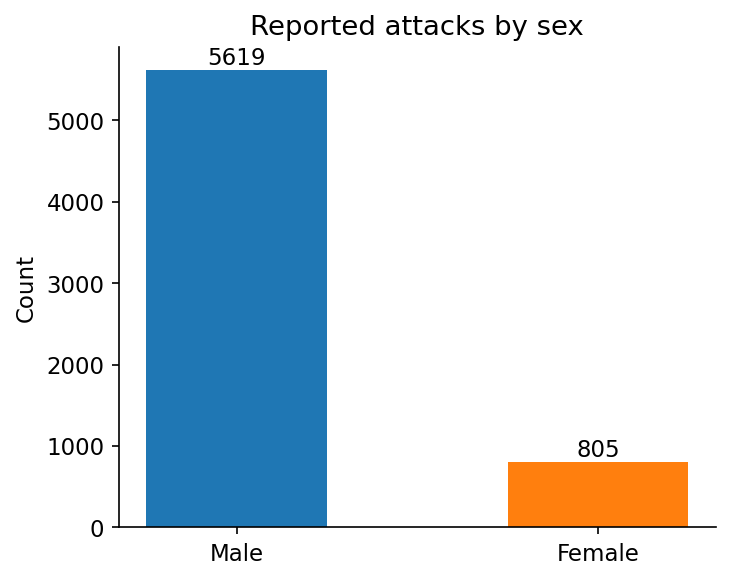

Males account for the overwhelming majority of recorded attacks — **5,619 male** vs **805 female** victims (roughly **7:1 ratio**). An additional 575 records have ambiguous or unknown sex, coded as "O". This disparity is primarily driven by activity exposure: historically, men participate in water sports, diving, and ocean fishing far more than women, so they are simply in the water more often. It should not be read as males being inherently more attractive to sharks.

---

### 2.2 Attack Type

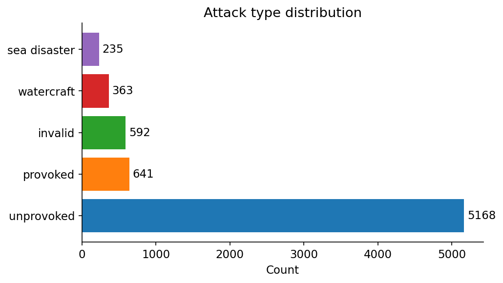

| Type | Count |
|------|-------|
| Unprovoked | 5,168 |
| Provoked | 641 |
| Invalid | 592 |
| Watercraft | 363 |
| Sea disaster | 235 |

**Unprovoked** attacks dominate (~74% of all records). "Invalid" cases are incidents where investigation found no shark involvement. **Sea disaster** events (shipwrecks, plane crashes into water) are rare but disproportionately deadly, as will be seen in the fatality section.

---

### 2.3 Fatality Outcome

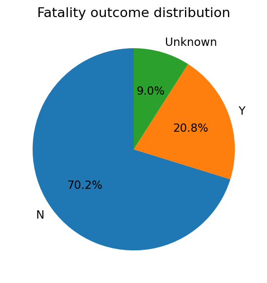

Of cases with a known outcome, **22.8% were fatal**. Roughly 9% of all records have an unknown outcome — these are primarily historical cases where follow-up was impossible. The relatively high fatality proportion (compared to popular intuition) reflects reporting bias: non-fatal attacks with minor injuries are less likely to be formally logged, especially in early records.

---

### 2.4 Age

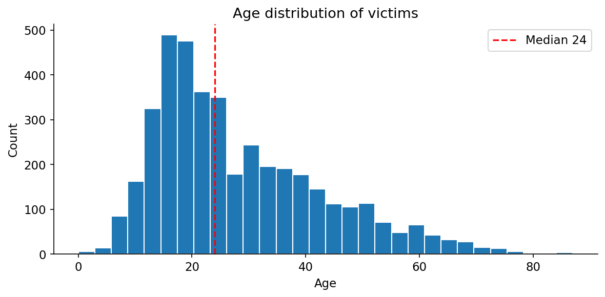

The age distribution is **strongly right-skewed**. The median victim age is **24 years**, with the bulk of victims aged 10–40. This aligns with the demographic that most frequently engages in ocean activities such as surfing, swimming, and diving.

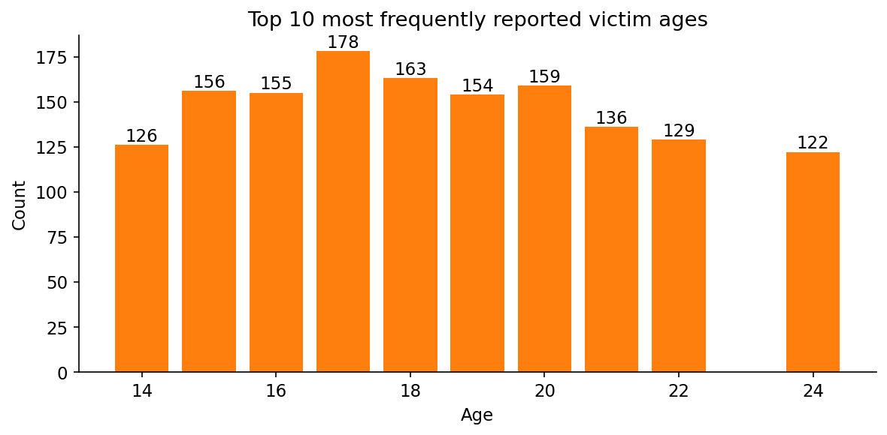

The most frequently reported ages are clustered in the **teens and early twenties** — ages 18, 20, 22, 25 appear prominently in the top 10. This may partly reflect rounding and self-reporting habits (victims or witnesses tend to report round numbers).

---

### 2.5 Country

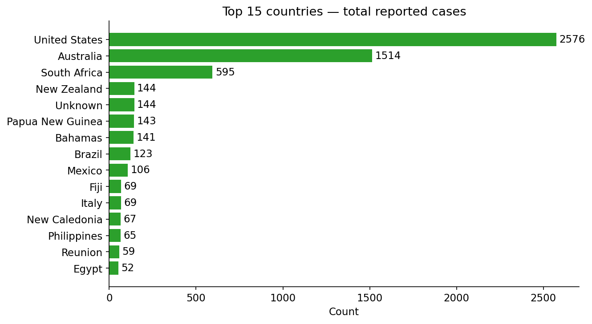

The **United States** leads by a large margin, followed by **Australia**, **South Africa**, and **Papua New Guinea**. This ranking reflects a combination of: long coastlines, high ocean-recreation culture, and well-maintained reporting systems. Countries with poor reporting infrastructure are likely under-represented.

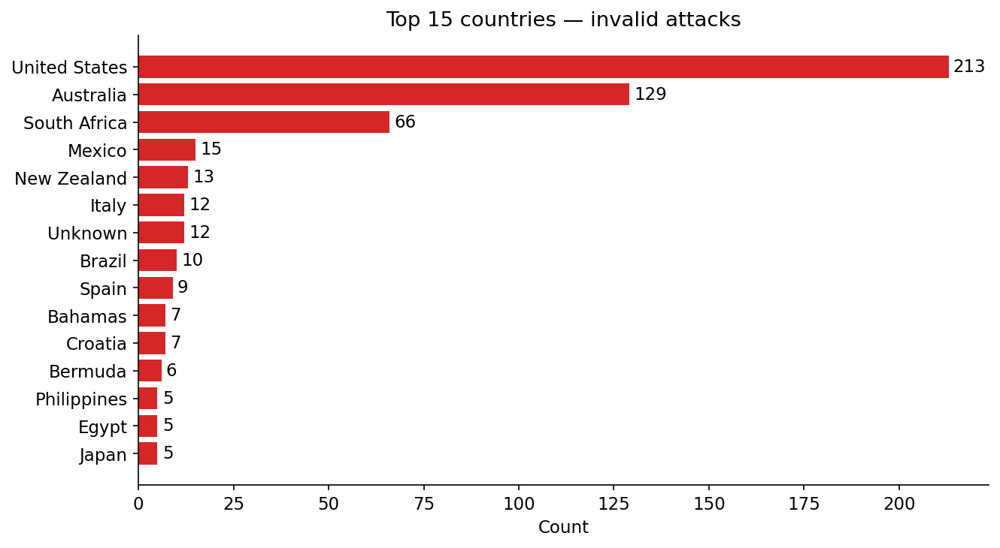

For **invalid attacks** (incidents where no shark involvement was confirmed), the **USA** again leads, followed by **Australia**. This is expected given those countries have the highest total case counts. A high invalid rate in a country can also indicate a more rigorous investigation culture where reports are carefully verified.

---

### 2.6 Time of Day

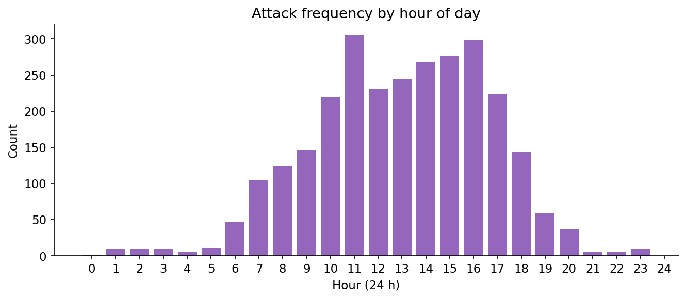

Attacks peak strongly between **08:00 and 18:00**, with the highest concentration in the **10:00–15:00** window. This mirrors peak beach/water activity hours. Very few attacks occur at night, though night diving and night fishing can still trigger incidents. Many records lack time data (coded as "?" or "Not stated"), so the distribution is based on the subset with valid timestamps.

---

### 2.7 Reports per Year

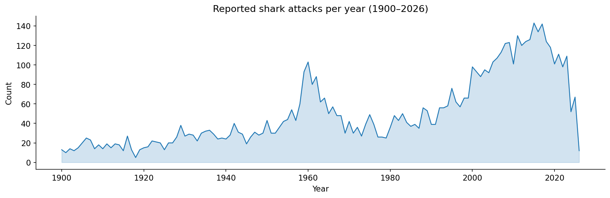

Reports were sparse until the mid-20th century, then rose sharply from the **1950s onward**, peaking around **2015 (143 cases)**. The growth is driven by three compounding factors:
- Increasing global ocean recreation participation
- Improved global communication and media coverage
- Better data collection by organisations such as the GSAF

A notable dip post-2015 may reflect the Covid-19 pandemy as well as improved shark mitigation measures, policy changes, or reporting gaps in recent years.

---

## 3. Bivariate — Categorical × Categorical

### 3.1 Sex vs Fatality

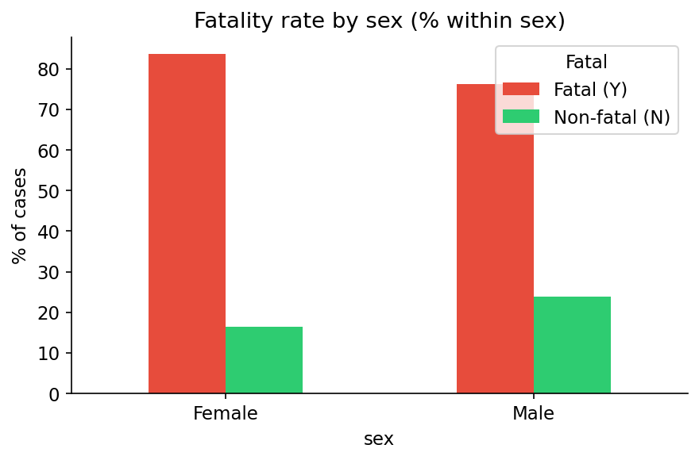

| Sex | N (non-fatal) | Y (fatal) | Fatal % |
|-----|--------------|-----------|---------|
| Female | 616 | 121 | **16.4%** |
| Male | 3,934 | 1,229 | **23.8%** |

**Males die at a meaningfully higher rate** (23.8% vs 16.4%). This cannot be fully explained by exposure alone. Contributing factors may include:
- Men more often engage in higher-risk activities (spearfishing, deep diving) where retreat is harder
- Men may delay seeking medical attention
- Attack severity may differ by activity type

---

### 3.2 Attack Type vs Fatality

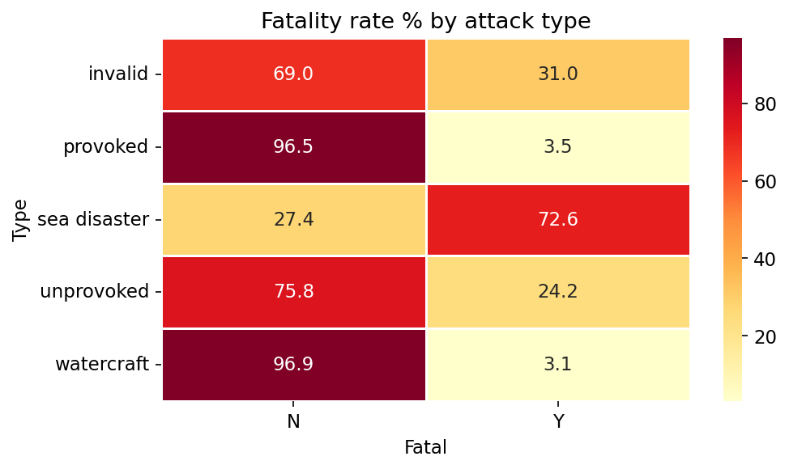
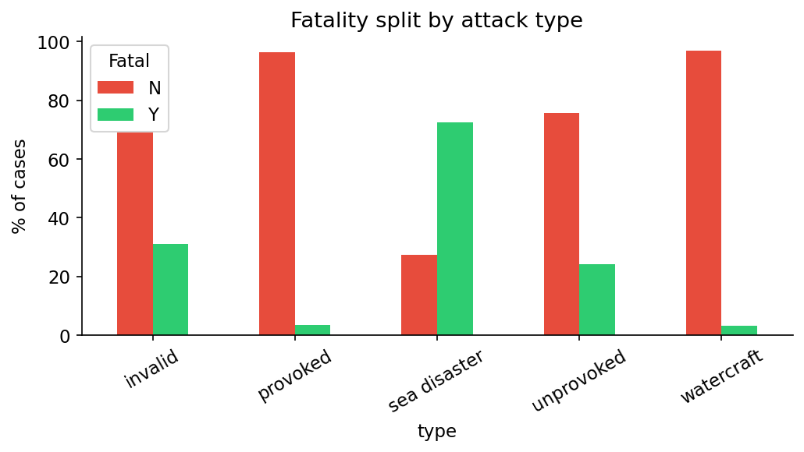

| Type | Fatal % |
|------|---------|
| Sea disaster | **72.6%** |
| Invalid | 31.0% |
| Unprovoked | 24.2% |
| Provoked | 3.5% |
| Watercraft | 3.1% |

**Sea disaster** is by far the deadliest category: these are shipwreck or crash survivors attacked in open water — no medical help, no escape, multiple victims. The high invalid fatality rate (31%) is puzzling at first glance; it likely reflects cases where a victim died and the attack was subsequently reclassified (e.g. the body was recovered with injuries inconsistent with shark bites).

**Provoked** and **watercraft** attacks are nearly always survivable (<4% fatal), because the victim has agency and can withdraw quickly.

---

### 3.3 Who Provokes More?

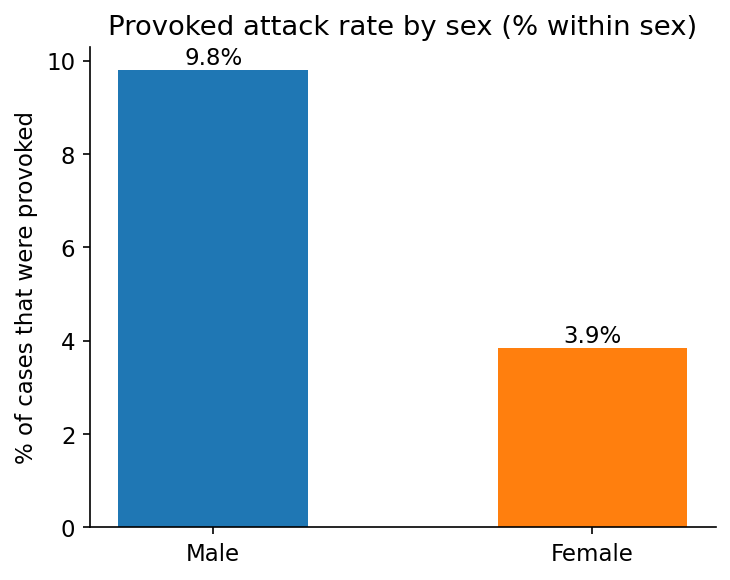
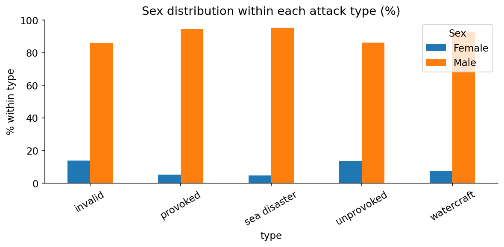

| Sex | Provoked attack rate |
|-----|---------------------|
| Male | **9.81%** |
| Female | **3.85%** |

Males provoke incidents at **2.5× the rate of females**. Provoked attacks typically involve handling, spearing, or otherwise disturbing a shark. This is consistent with male-dominated activities like spearfishing and underwater photography.

**Crucially, provocation dramatically reduces fatality risk** (3.5% vs 24.2% for unprovoked). When you provoke a shark, you are typically close, in control of the interaction, and the attack tends to be a warning bite — you can react immediately.

---

### 3.4 Type × Country

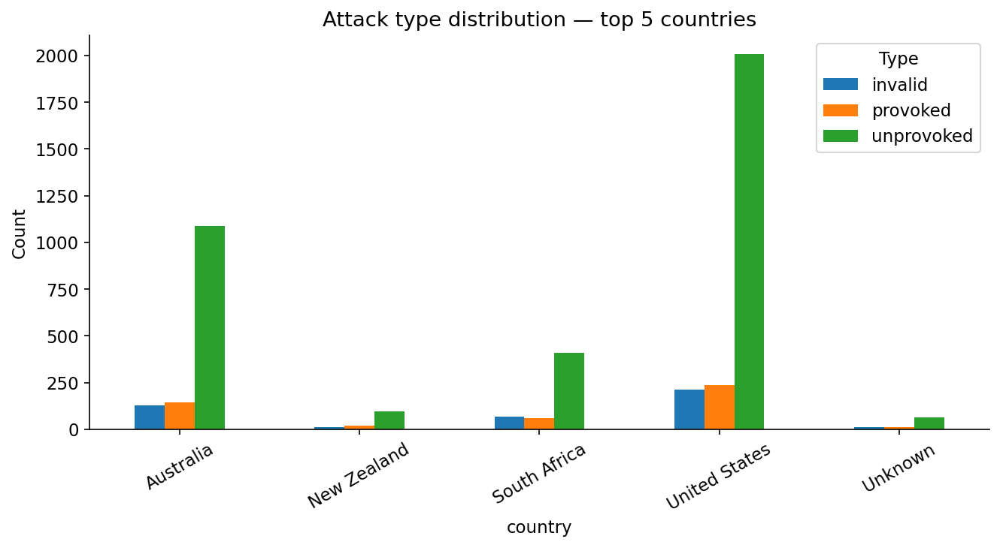

Across the top 5 countries, **unprovoked attacks** dominate in every nation, but the relative proportions differ. Australia and South Africa show a higher proportion of unprovoked attacks relative to provoked ones, while the USA has a larger share of watercraft-related incidents, reflecting the recreational boating culture on US coastlines.

---

## 4. Bivariate — Age × Categorical

### 4.1 Age by Fatality

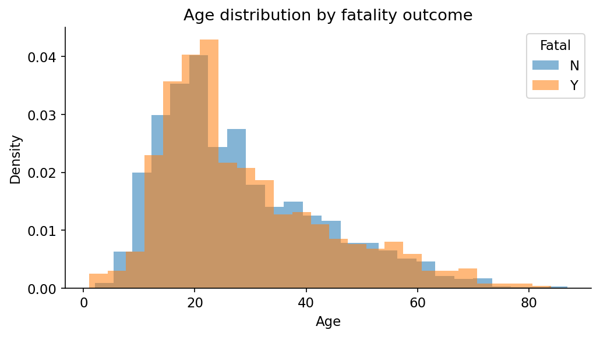

| Outcome | Mean age | Median age | Count |
|---------|----------|------------|-------|
| Non-fatal | 28.0 | 24.0 | 3,094 |
| Fatal | 28.7 | 24.0 | 709 |

The age distributions for fatal and non-fatal outcomes are **nearly identical** (median 24 in both). Age alone has virtually no predictive power for fatality — the species, depth, time to medical care, and attack severity matter far more.

---

### 4.2 Children vs Adults vs Seniors

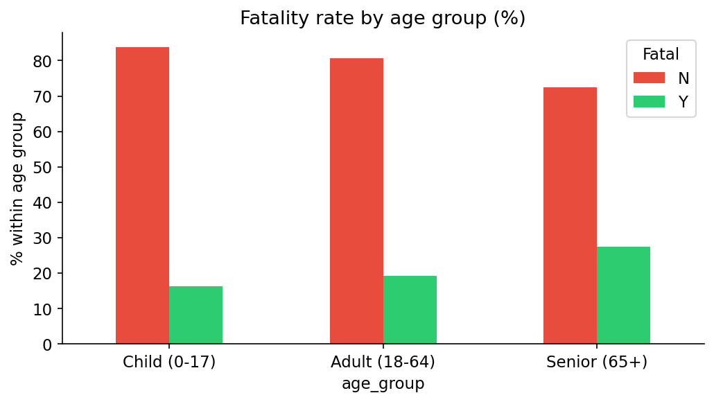

| Age group | Fatal % |
|-----------|---------|
| Child (0–17) | **16.3%** |
| Adult (18–64) | **19.3%** |
| Senior (65+) | **27.5%** |

**Seniors face the highest fatality rate**, likely due to reduced physical capacity to escape, pre-existing cardiovascular conditions exacerbating shock and blood loss, and potentially slower access to care. Children fare best — perhaps because children's attacks tend to occur in shallower, supervised water (beach swimming) where help is nearby.

---

### 4.3 Age by Sex

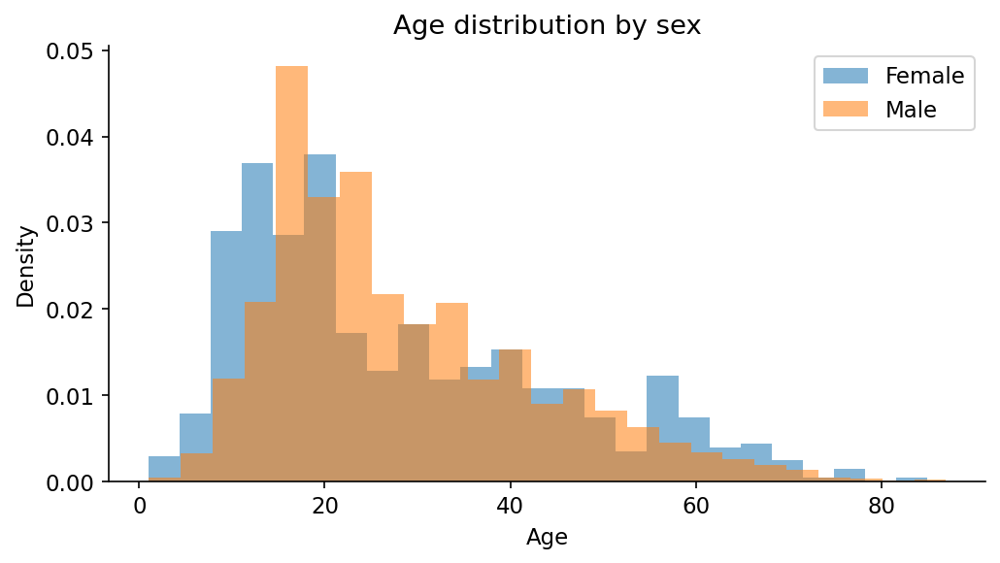
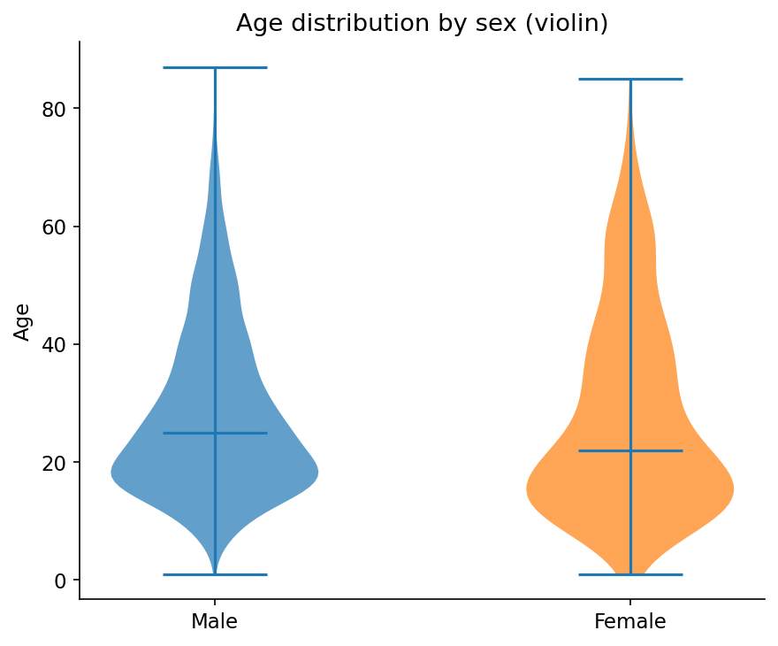
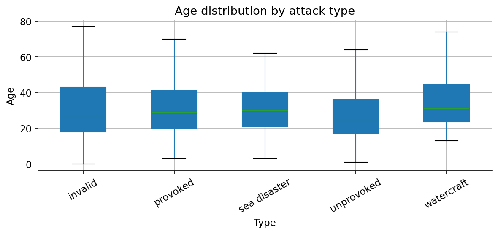

Female victims skew slightly older than male victims. This could reflect that older women are more likely to be the ones swimming in beach environments, while young males dominate surfing and diving. Unprovoked and provoked attack victims span a wide age range; sea disaster victims tend toward middle age (consistent with adult maritime workers/passengers).

---

## 5. Temporal Analysis

### 5.1 Monthly Patterns

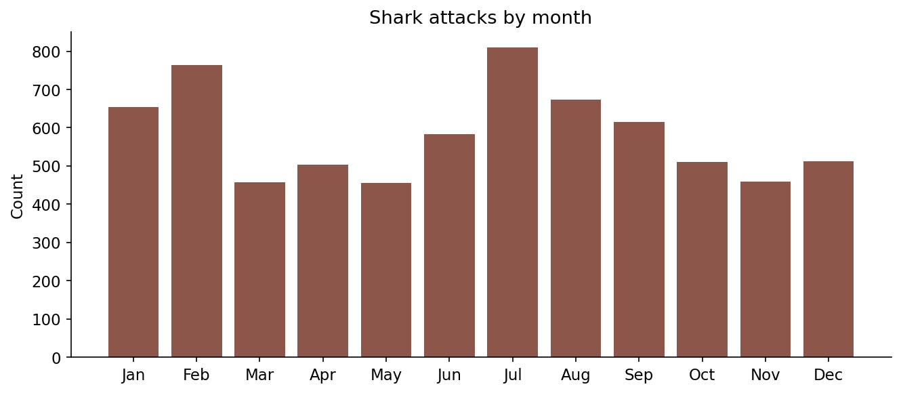
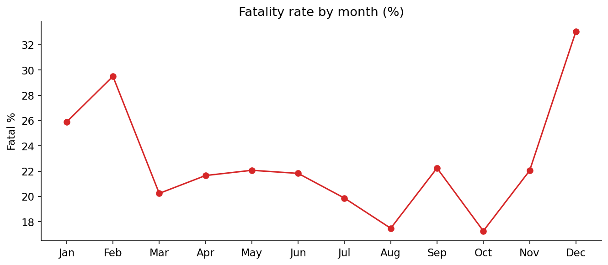

Attack **volume** peaks in **June–August** (Northern Hemisphere summer), which brings more people to the beach. However, **fatality rate** does not track case volume directly — it fluctuates across the year without a clean summer peak. December and January show elevated fatality rates in some years, possibly due to Southern Hemisphere summer (Australia, South Africa) driving both more attacks and higher-severity species encounters.

---

### 5.2 Seasonal Patterns

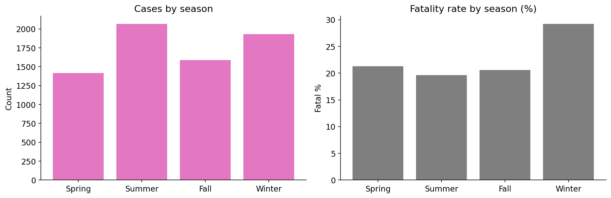

| Season | Cases | Fatal % |
|--------|-------|---------|
| Summer | 2,065 | 19.6% |
| Winter | 1,922 | **29.1%** |
| Fall | 1,586 | 20.6% |
| Spring | 1,416 | 21.3% |

**Winter produces the highest fatality rate (29.1%)** despite not having the most cases. This seeming paradox resolves when geography is considered: "Winter" for this dataset is the calendar season — which means it corresponds to Summer in Australia and South Africa, where the most dangerous species (Great White, Tiger, Bull) are most active in warmer water. Southern Hemisphere summer attacks tend to be more severe.

---

## 6. Time Series

### 6.1 Yearly Trend by Type

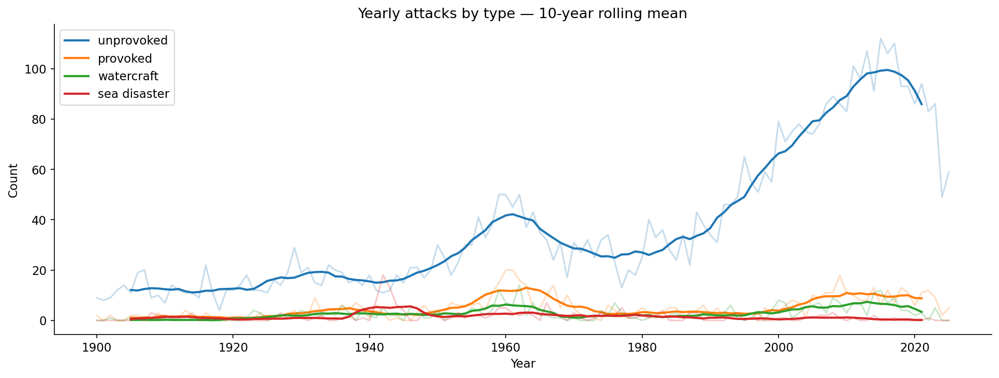

Using a **10-year rolling mean** to smooth noise: unprovoked attacks show clear growth from the 1950s, peaking around 2010–2015. Provoked attacks grew more modestly. Sea disaster events were concentrated around the two World Wars — large naval engagements created mass shark-attack events in open ocean (e.g., USS Indianapolis, 1945). Since ~1950, sea disasters have become rare.

---

### 6.2 Anomaly Detection

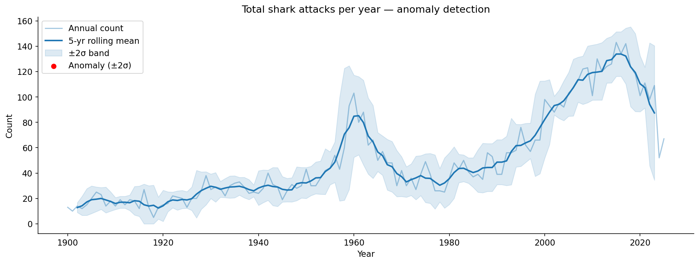

Using a ±2σ band around the 5-year rolling mean, **no statistically significant anomaly years** were detected in the 1900–2025 window at this threshold. The data grows relatively smoothly. This suggests the trend is driven by gradual secular changes (more ocean activity, better reporting) rather than discrete shock events.

---

### 6.3 Yearly Trend by Country

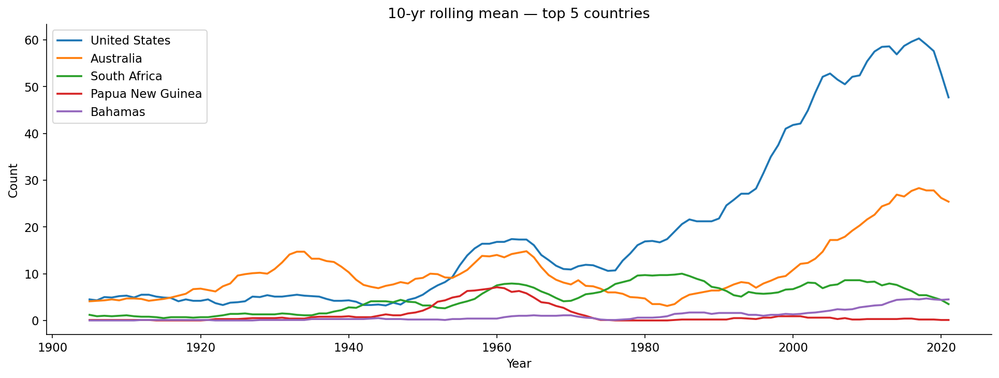

The **USA dominates** across the full 20th century. **Australia's** rolling count rises sharply after 1950 and remains high. **South Africa** shows a modest but consistent increase. Newer entrants like **Papua New Guinea** and **Brazil** show growth primarily from the 1990s onward, reflecting both real increases in incidents and improved reporting infrastructure.

---

### 6.4 Fatality Rate Over Time

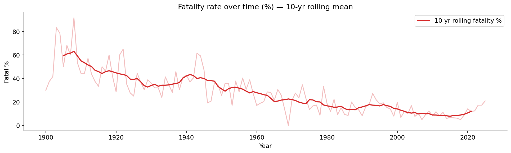

The fatality rate has **declined dramatically** over the 20th century. In the early 1900s, fatality rates exceeded 50–60%. By 2000–2025, the 10-year rolling rate is closer to **15–20%**. This reflects:
- Advances in emergency medicine and trauma care
- Faster rescue and evacuation infrastructure
- Better wound management knowledge among lifeguards and bystanders
- Possibly a shift toward attacks in populated beaches where help is immediately available

The strong **negative correlation between year and fatality** (r = −0.31) found in the correlation matrix confirms this trend quantitatively.

---

## 7. Multivariate / Correlation

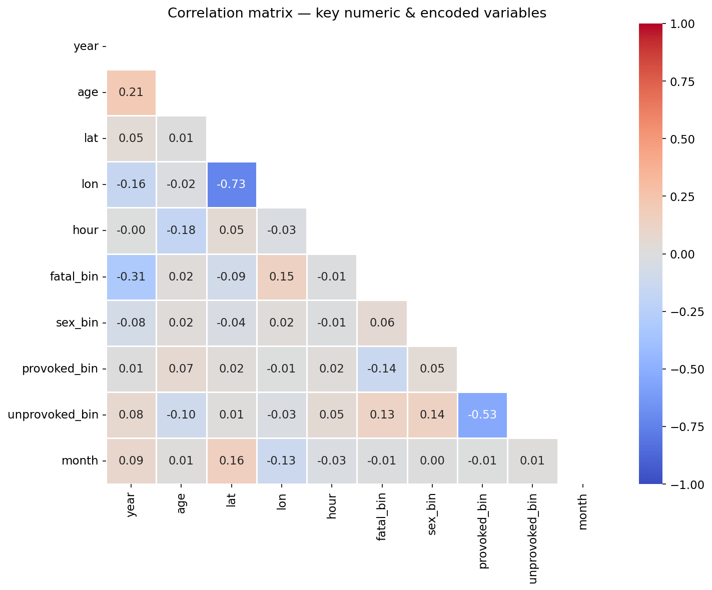
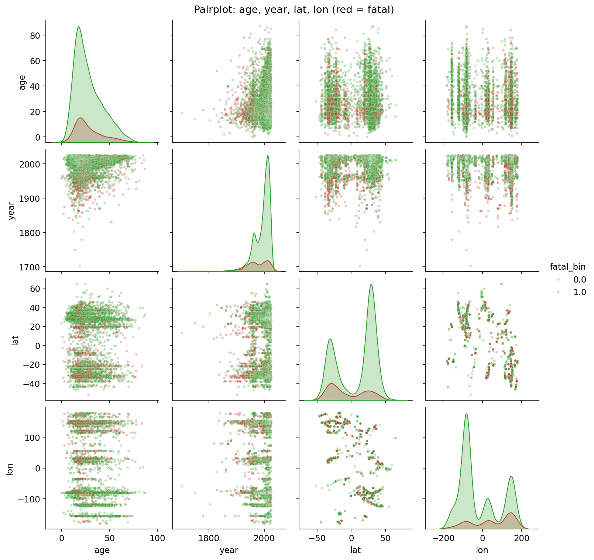

**Correlations with fatality (binary):**

| Variable | r |
|----------|---|
| year | **−0.312** |
| longitude | 0.147 |
| provoked_bin | −0.136 |
| unprovoked_bin | 0.130 |
| latitude | −0.090 |
| sex_bin (male) | 0.055 |
| age | 0.016 |
| month | −0.012 |
| hour | −0.012 |

Key insights:
- **Year is the single strongest predictor** of survival — more recent attacks are less likely to be fatal (medical progress).
- **Longitude matters** (r = 0.147): attacks in the Indian Ocean / Eastern Africa zone tend to be more fatal — consistent with the geographic findings below.
- **Provoked attacks reduce fatality risk** (r = −0.136), while unprovoked attacks increase it (r = 0.130).
- **Age is essentially uncorrelated** with fatality (r = 0.016) when taken raw, though the age-group analysis revealed a non-linear effect (seniors at higher risk).
- **Sex has a small but real effect** (r = 0.055): being male is mildly associated with fatality.

---

## 8. Geographic Analysis

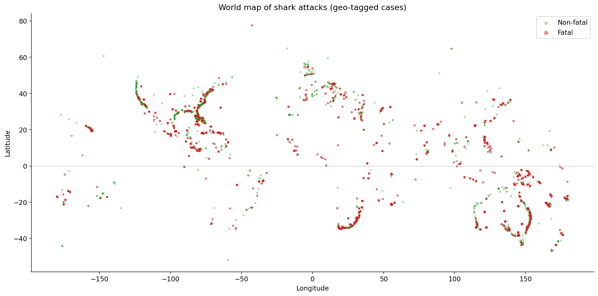
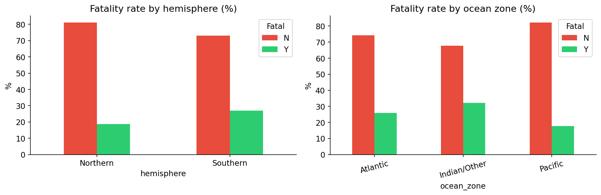

### By Hemisphere

| Hemisphere | Fatal % |
|-----------|---------|
| Southern | **27.0%** |
| Northern | 18.8% |

The **Southern Hemisphere is significantly more dangerous** (+8 percentage points). This is where the highest-density great white and tiger shark populations overlap with human activity (Australia, South Africa, Réunion Island, Brazil).

### By Ocean Zone

| Zone | Fatal % |
|------|---------|
| Indian Ocean / Other | **32.2%** |
| Atlantic | 25.8% |
| Pacific | 17.7% |

The **Indian Ocean zone records the highest fatality rate** (32.2%). This region encompasses East African coastlines (Réunion, Mozambique, Madagascar, Tanzania) where medical infrastructure is limited and attacks often occur far from shore. The **Pacific** has the lowest rate, partly due to the dominance of well-monitored Australian and Hawaiian beaches in the dataset.

---

## 9. Species Analysis

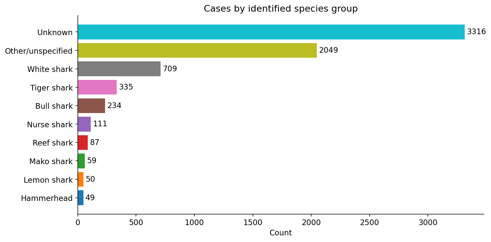
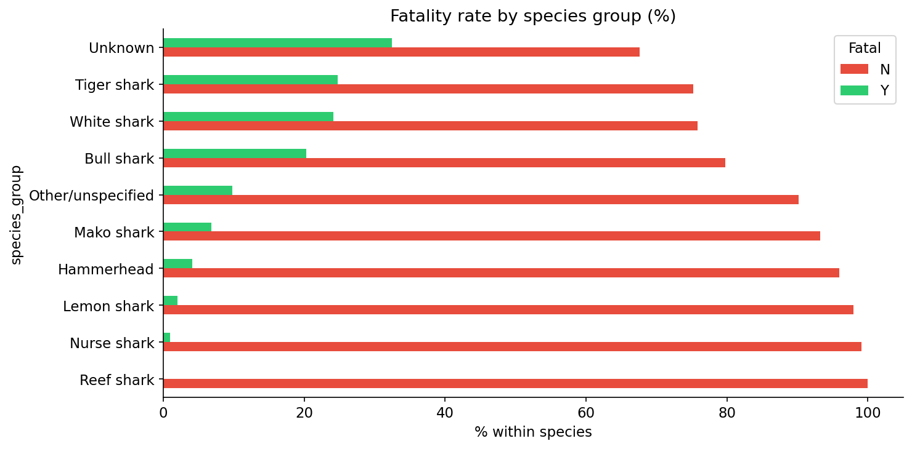

| Species | Fatal % |
|---------|---------|
| Nurse shark | **0.9%** |
| Reef shark | 0.0% |
| Hammerhead | 4.1% |
| Mako | 6.8% |
| Bull shark | 20.3% |
| White shark | 24.1% |
| Tiger shark | 24.8% |
| Unknown | 32.4% |

The "Big Three" dangerous species — **Tiger, White, and Bull sharks** — all show 20–25% fatality rates. These species are large, powerful, and capable of inflicting devastating wounds.

**Unknown species** have the highest logged fatality rate (32.4%), which is likely a selection artifact: in very severe or fatal attacks, there may not be a survivor or witness capable of identifying the species.

**Reef and Nurse sharks** are essentially harmless to humans (0–0.9% fatality) — they rarely attack unprovoked, and when they do, bites are defensive warning nips rather than feeding behaviour.

---

## 10. Activity Analysis

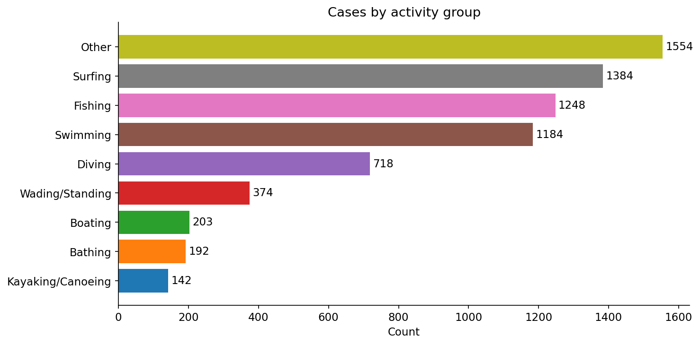
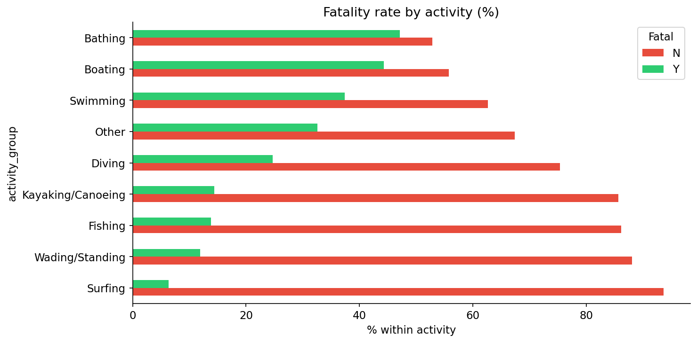

| Activity | Fatal % |
|----------|---------|
| Bathing | **47.1%** |
| Boating | **44.3%** |
| Swimming | 37.4% |
| Diving | 24.7% |
| Other | 32.6% |
| Kayaking/Canoeing | 14.4% |
| Fishing | 13.8% |
| Wading/Standing | 11.9% |
| Surfing | **6.4%** |

**Surfing is the safest activity** despite being the most commonly reported one. Surfers are in shallow water, visible from shore, and can paddle away quickly; attacks tend to be investigatory bites on the board that cause limited injury.

**Bathing (47.1%) and Boating (44.3%)** have the highest fatality rates. Bathing scenarios often involve people who are not strong swimmers, attacked in deeper or murkier water far from immediate help. Boating incidents frequently involve people falling overboard in open ocean — the same dynamics as sea disasters at smaller scale.

**Fishing** (13.8%) and **wading** (11.9%) are relatively low-fatality: the victim is usually in shallow water and can retreat.

---

## 11. Key Findings Summary

| Question | Finding |
|----------|---------|
| Who gets attacked more — men or women? | Men: 7× more attacks (exposure driven) |
| Do men die more frequently? | Yes — 23.8% vs 16.4% fatal rate |
| Who provokes more? | Men provoke 2.5× more often (9.8% vs 3.9%) |
| Does provocation increase death risk? | No — it drastically *reduces* it (3.5% vs 24.2%) |
| Do children die more than adults? | No — seniors are most at risk (27.5% fatal) |
| Correlation between age and fatality? | Minimal (r = 0.016); non-linear: seniors most vulnerable |
| Most dangerous ocean? | Indian Ocean (32.2% fatal) |
| Most dangerous hemisphere? | Southern (27% vs 19%) |
| Is there a fatality trend over time? | Yes — strong decline; year is strongest predictor (r = −0.31) |
| Most cases in which season? | Summer (2,065 cases) |
| Highest fatality rate season? | Winter (29.1% — driven by Southern Hemisphere summer) |
| Most common attack type? | Unprovoked (74%) |
| Deadliest attack type? | Sea disaster (72.6%) |
| Country with most cases? | United States |
| Country with most invalid cases? | United States |
| Peak year? | 2015 (143 cases) |
| Deadliest shark? | Tiger and White shark (~24–25% fatality) |
| Safest shark encounter? | Reef and Nurse shark (<1% fatality) |
| Deadliest activity? | Bathing (47.1%) |
| Safest activity (by fatality)? | Surfing (6.4%) |
| Most frequent attack hour? | 10:00–15:00 |
| Most frequently reported victim age? | 18–25 |

---

*Report generated from `analysis.py` · 35 plots in `plots/` directory*
